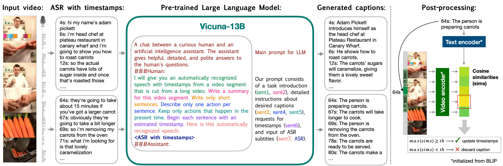

# HowToCaption: Prompting LLMs to Transform Video Annotations at Scale

<p align="center">
  
</p>

Official PyTorch implementation of the paper ["HowToCaption: Prompting LLMs to Transform Video Annotations at Scale"](https://arxiv.org/abs/2310.04900), ECCV 2024.

by [<ins>Nina Shvetsova*</ins>](https://ninatu.github.io/), 
[<ins>Anna Kukleva*</ins>](https://annusha.github.io/),
[<ins>Xudong Hong</ins>](https://xudonghong.me/),
[<ins>Christian Rupprecht</ins>](https://chrirupp.github.io/),
[<ins>Bernt Schiele</ins>](https://www.mpi-inf.mpg.de/departments/computer-vision-and-machine-learning/people/bernt-schiele),
[<ins>Hilde Kuehne</ins>](https://hildekuehne.github.io/).

[**[arXiv]**](https://arxiv.org/abs/2301.02009) 


## HowToCaption Dataset

We release the **HowToCaption dataset**. Check the [**dataset readme**](dataset/) to download it.

The HowToCaption dataset comprises
1.2M long-term instructional videos from [the HowTo100M dataset](https://www.di.ens.fr/willow/research/howto100m/), 
where ASR subtitles have been transformed into proper captions
via our HowToCaption method using [the Vicuna-13B LLM](https://lmsys.org/blog/2023-03-30-vicuna/) ([v0](https://github.com/lm-sys/FastChat/blob/main/docs/vicuna_weights_version.md)). 
The captions are automatically generated 
and their high-quality alignment to the video are further 
ensured through subsequent alignment and filtering post-processing, 
all achieved without any human involvement. As a result, the HowToCaption dataset contains 25M aligned video-text pairs.

## Pretrained Models

Using the proposed HowToCaption dataset, we pretrained video-language models (initialized from the image-text [BLIP model](https://arxiv.org/abs/2201.12086)):
All checkpoints are available [here](https://drive.google.com/drive/folders/1tZICCBaRW_wwBIfjNfg7qmfpD1LopQfF?usp=sharing). 

| Method  | Model size | Dataset | YouCook2 | | MSRVTT | |
|---------|------------|------------|-----|-----|-----|-----|
|   |  |  | R1 | R10 | R1 |  R10 | 
| [Dual Encoder Model](https://drive.google.com/file/d/1gZhQ8ZdiD-j10NXAxVn-CGluxwLm3Ecj/view?usp=sharing) | ViT-B | HowTo100M | 12.2  | 39.3 | 30.8  | 61.7 |
| [Dual Encoder Model](https://drive.google.com/file/d/1vsyTKKPmaxDYUo9c9zdFGTxsT-0-tNbC/view?usp=sharing) | ViT-B | WebVid2M | 7.3 | 29.0 | 38.5 | 71.9 |
| [Dual Encoder Model](https://drive.google.com/file/d/1Lr3FI9T8Yt7hJo4MzW8DB1MyfIwZHM98/view?usp=sharing) | ViT-B | **HowToCaption** | 13.4 | 44.1  | 37.6 | 73.3 | 
| [Full Model (with re-ranking)](https://drive.google.com/file/d/11EEoVPpz-iqVQMXariE2xQZstYDYo2vS/view?usp=sharing) | ViT-B | **HowToCaption** | 18.15  | 50.4  | 44.3  | 76.6 | 
| [Full Model (with re-ranking)](https://drive.google.com/file/d/1D_IN0dUbagLvGA4iw81uG101FwLsnILk/view?usp=sharing) | ViT-L | **HowToCaption** | 19.9 | 53.2  | 45.2 | 77.8 |

Full Model (ViT-B) fine-tuned for video captioning:

| Dataset  | BLEU@4 | METEOR | ROUGE | CIDEr|
|---------|------------|------------|-----|-----|
| [YouCook2](https://drive.google.com/file/d/1Hl5nQx0lvuPwtOxmhIU1V8dtYMLypyGc/view?usp=sharing) | 8.8 | 15.9 | 37.3 | 116.4 |
| [MSRVTT](https://drive.google.com/file/d/1KzRDBee-JspNYd4N1a-0ZcxmW0dSFHyW/view?usp=sharing) | 49.8 | 32.2 | 66.3 | 65.3 |
| [MSVD](https://drive.google.com/file/d/1D_3BjPxUeHuHRCQXqk5YEOL97Q4TA_Pp/view?usp=sharing) | 70.4 | 46.4 | 83.2 | 154.2 |

We also release weights for the fine-tuned [VAST](https://github.com/TXH-mercury/VAST) ViT-L model: [weights](https://drive.google.com/file/d/1biT_wj8SMsPB6i9h59StP3X3tz5l2L9L/view?usp=sharing). 

## Get Started

### Set Up an Environment

```shell
conda create python=3.8 -y -n howtocaption
conda activate howtocaption
conda install -y pytorch==1.10.1 torchvision==0.11.2 torchaudio==0.10.1 cudatoolkit=11.3 -c pytorch -c conda-forge
pip install -r requirements.txt
pip install -e . 
```

### Data Preparation 

#### HowTo100M Dataset

Preprocess data into the `data/howto100m` folder:
  1. Link the folder to the videos of [HowTo100M](https://www.di.ens.fr/willow/research/howto100m/) in `data/howto100m/videos` 
  2. Create a CSV file `data/howto100m/video_path_downloaded.csv` with video_id and video_path correspondences (path should be relative to the folder `data/howto100m/videos`). For example:
 
```
    video_id, video_path
    RoupYOneCIo,food_and_entertaining/video_R/RoupYOneCIo.webm	 
    Zx3_yGY_ERs, food_and_entertaining/video_Z/Zx3_yGY_ERs.mp4
```

#### HowToCaption Dataset

Follow the [**dataset readme**](dataset/) to download the HowToCaption dataset and store it in `data/howtocaption`.

#### MSRVTT, YouCook2, MSVD, LSMDC

Follow [CLIP4CLIP guidelines](https://github.com/ArrowLuo/CLIP4Clip) to download the MSRVTT, MSVD, and LSMDC datasets. 
Follow the [YouCook2 guidelines](http://youcook2.eecs.umich.edu/) to download YouCook2. Put datasets in corresponding folders:  
`data/msrvtt`, `data/msvd`, `data/lsmdc`, `data/youcook2`.

## Video-Language Models

### Configs

This repository uses YAML files to keep all hyperparameters. The `configs` folder contains configs for LLM prompting, vision-language model
training, and evaluation.

### Experiment Logging

This repository uses Sacred with [neptune.ai](https://neptune.ai/) for logging and tracking experiments. If you want to activate this:

1. Create a [neptune.ai](https://neptune.ai/) account (you may ask for an academic account if applicable).
2. Create a project, and copy your credentials (api_token, project name) in `train.py`.
3. Add the --neptune key to `train.py`. 

### Run Evaluation

Evaluate video retrieval (without re-ranking):

```shell
export MASTER_PORT=12345
export WORLD_SIZE=4
export MASTER_ADDR=localhost

torchrun --standalone --nnodes=1 --nproc_per_node=${WORLD_SIZE} \
    howtocaption/eval.py \
    --resume pretrained/dual_encoder_retrieval.pth\
    -c configs/VL_training/dual_encoder_retrieval.yaml \
    --distributed 1 \
    --world_size ${WORLD_SIZE} \
    --eval_retrieval
```

Evaluate video captioning:

```shell
export MASTER_PORT=12345
export WORLD_SIZE=4
export MASTER_ADDR=localhost

torchrun --standalone --nnodes=1 --nproc_per_node=${WORLD_SIZE} \
    howtocaption/eval.py \
    --resume pretrained/captioning_msrvtt.pth\
    -c configs/VL_training/captioning_msrvtt.yaml \
    --distributed 1 \
    --world_size ${WORLD_SIZE} \
    --eval_captioning 
```

See more configs in `configs/` and models [here](https://drive.google.com/drive/folders/1tZICCBaRW_wwBIfjNfg7qmfpD1LopQfF?usp=sharing). 

For retrieval evaluation with re-ranking, we followed the [VAST](https://github.com/TXH-mercury/VAST) implementation. 

### Run Training

Train Dual-Encoder Model (initialized from BLIP) on HowToCaption Dataset:

```shell
export MASTER_PORT=12345
export WORLD_SIZE=4
export MASTER_ADDR=localhost

torchrun --standalone --nnodes=1 --nproc_per_node=${WORLD_SIZE} \
    howtocaption/train.py \
    -c configs/VL_training/dual_encoder_retrieval.yaml \
    --distributed 1 \
    --world_size ${WORLD_SIZE}
```

Train Full Encoder-Decoder Model (initialized from BLIP) on HowToCaption Dataset:

```shell
export MASTER_PORT=12345
export WORLD_SIZE=4
export MASTER_ADDR=localhost

torchrun --standalone --nnodes=1 --nproc_per_node=${WORLD_SIZE} \
    howtocaption/train.py \
    -c configs/VL_training/dual_encoder_retrieval.yaml \
    --distributed 1 \
    --world_size ${WORLD_SIZE}
```

See more configs in `configs/`. 

### HowToCaption Framework

#### LLM Prompting

We share all steps of the HowToCaption framework with an example of applying it to the HowTo100M dataset.
1. Make sure `videos` and `video_path_downloaded.csv` are in `data/howto100m` (as described in **Data Preparation**).

2. Prepare ASR annotation. Download them, filter by downloaded videos, and divide them into 200-word blocks. We used the [Sentencified HTM](https://www.robots.ox.ac.uk/~vgg/research/tan/index.html#dataset-summary) 
version of ASR annotation, where ASR was preprocessed into full sentences.

```shell
wget http://www.robots.ox.ac.uk/~htd/tan/sentencified_htm_1200k.json -P data/howto100m
python howtocaption/llm_prompting/scripts/1_filter_available.py --asr data/howto100m/sentencified_htm_1200k.json \
  --csv data/howto100m/video_path_downloaded.csv --output_folder data/howto100m/
python howtocaption/llm_prompting/scripts/2_create_word_blocks.py --asr data/howto100m/asr_filtered.pickle \
  --n_words_max 200  --output_key '200w'
```

You can use `video_path_filtered_s50.pickle` with only 50 videos for a quick start with later prompting Vicuna:  
```shell
python howtocaption/llm_prompting/scripts/2_create_word_blocks.py --asr data/howto100m/asr_filtered_s50.pickle \
    --n_words_max 200 --output_key '200w'
```

3. Download Vicuna weights. We used [Vicuna-13B (v0)](https://github.com/lm-sys/FastChat/blob/main/docs/vicuna_weights_version.md). 
To download LLaMA weights and Vicuna-13B delta and apply delta weights, follow the [official instruction "How to Apply Delta Weights"](https://github.com/lm-sys/FastChat/blob/main/docs/vicuna_weights_version.md). 

4. Prompt the Vicuna model to transform ASRs into captions. Results will be saved in a separate file for each video_id.
**Tip:** Run the same script on multiple GPUs to speed up processing. You may use `asr_filtered_s50.pickle` for a quick start. 

```shell
python howtocaption/llm_prompting/prompt_vicuna.py --config configs/vicuna/final_prompt.yaml \
  --asr-path data/howto100m/asr_filtered.pickle \
  --model-path '/BS/nshvetso/work/cache/huggingface/transformers/models--vicuna-13b'
```

5. Collect all Vicuna predictions into a single pickle with input timestamps.
```shell
python howtocaption/llm_prompting/scripts/3_collect_predictions.py --config configs/vicuna/final_prompt.yaml \
  --asr-path data/howto100m/asr_filtered.pickle \
  --output-path output/vicuna/final_prompt.pickle
```  

#### Alignment & Filtering

1. Extract embeddings for all frames:

```shell
config=blip
python howtocaption/save_frame_embeddings.py \
  -c configs/align_and_filter/${config}.yaml
```

  Tip: Use `--process_only_part_i` and `--number_of_parts` to process only part of the input data in the current process. For example:

```shell
config=blip
process_only_part_i=0
python howtocaption/save_frame_embeddings.py \
  -c configs/align_and_filter/${config}.yaml \
  --process_only_part_i ${process_only_part_i} \
  --number_of_parts 64 
```

2. Extract embeddings for all generated captions:
   
```shell
config=blip
llm_predictions=final_prompt
python howtocaption/save_text_embeddings.py \
    --llm_predictions output/vicuna/${llm_predictions}.pickle  \
    -c configs/align_and_filter/${config}.yaml
```

3. Create alignment and filtering:

```shell
config=blip
llm_predictions=final_prompt
python howtocaption/align_and_filter.py \
  --frame_embeddings output/embeddings/video_${config}.pickle \
  --text_embeddings output/embeddings/text_${config}_${llm_predictions}.pickle \
  --top_pairs_threshold 25000000 \
  --output output/generated_dataset/${config}_${llm_predictions}.pickle
```

4. Fine-tune the video-language model on initial alignments (or use our [fine-tuned model](https://drive.google.com/file/d/1qRn6FQyywv5-l6b7UzPMKcLVNCXS0YIk/view?usp=sharing)). 
Add the path to aligned captions in the config 
`configs/align_and_filter/finetune_1round.yaml` and fine-tune the model:

```shell
export MASTER_PORT=12345
export WORLD_SIZE=4
export MASTER_ADDR=localhost

torchrun --standalone --nnodes=1 --nproc_per_node=${WORLD_SIZE} \
    howtocaption/train.py \
    -c configs/align_and_filter/finetune_1round.yaml\
    --distributed 1 \
    --world_size ${WORLD_SIZE}
```

5. Extract text and video features with the new model and repeat re-alignment using both the original and new features.

```shell
config1=blip
config2=blip_ft_1round
llm_predictions=final_prompt
python howtocaption/align_and_filter.py \
  --frame_embeddings output/embeddings/video_${config1}.pickle output/embeddings/video_${config2}.pickle \
  --text_embeddings output/embeddings/text_${config1}_${llm_predictions}.pickle  output/embeddings/text_${config2}_${llm_predictions}.pickle \
  --top_pairs_threshold 25000000 \
  --output output/generated_dataset/average_${llm_predictions}.pickle
```

## Acknowledgments and Licenses

The main structure of the code is based on
https://github.com/victoresque/pytorch-template, which is licensed under MIT. 

The code is partly derived from
https://github.com/salesforce/BLIP,
https://github.com/ArrowLuo/CLIP4Clip,
https://github.com/whwu95/Cap4Video,
https://github.com/lm-sys/FastChat,
https://github.com/tylin/coco-caption
is licensed under an Apache License 2.0 or MIT or BSD-3.

All other code is licensed under MIT. All license clauses are in the LICENSE file.

## Citation 

If you use this code in your research, please cite:

```
@article{shvetsova2023howtocaption,
  title={HowToCaption: Prompting LLMs to transform video annotations at scale},
  author={Shvetsova, Nina and Kukleva, Anna and Hong, Xudong and Rupprecht, Christian and Schiele, Bernt and Kuehne, Hilde},
  journal={ECCV},
  year={2024}
}
```